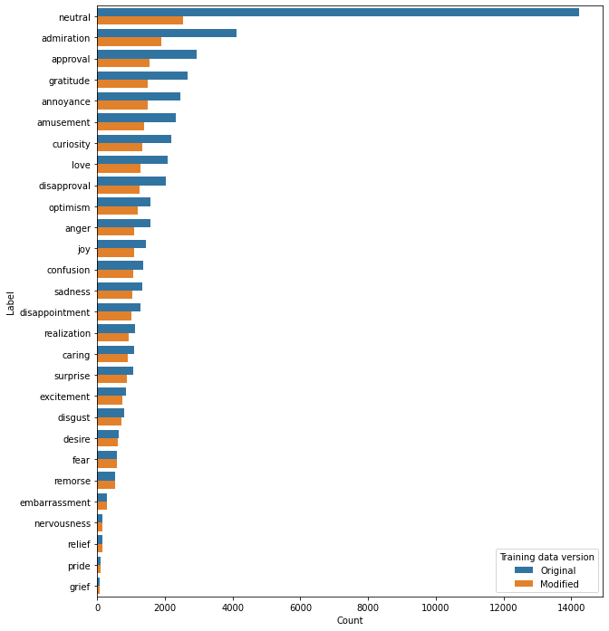

# Go Emotions Dataset

The GoEmotions dataset contains 58k carefully curated Reddit comments labeled for 27 emotion categories or Neutral.

This dataset is not mine, it was downloaded from HuggingFace datasets in the following link: https://huggingface.co/datasets/google-research-datasets/go_emotions

And it was published in the 58th Annual Meeting of the Association for Computational Linguistics, pages 4040–4054. The paper title is "GoEmotions: A Dataset of Fine-Grained Emotions", authored by Demsky et al., 2020, and can be found at: https://aclanthology.org/2020.acl-main.372

The simplified version of the origina data, as provided in HuggingFace website, can be found in the directory "data/raw".

# Modifications

This repository contains a modified version of the dataset where I split the training data in two: half the data to train a classifier, and the other half I leave for other purposes, such as applying active learning techniques or simulating new data in a production envinronment. The script "src/prepare_initial_data.py" contains the code used to do so. You can run the following command in the root directory of the project "python src/prepare_initial_data.py --input_data_path data/raw --output_data_path data/model_data".

While splitting the training data in two, I prioritized keeping the samples that contain the least frequent classes in the classifier's training data. The following chart shows the occurrences of each class in the original training data and in the modified version. The latter corresponds to the "data/model_data/train_initial_data.json" file.

I also removed the "neutral" class from the data, since it has no sentiment attached to it. It was used as a "fill up" label during dataset construction.

The modified version of the data can be found in the directory "data/model_data".
